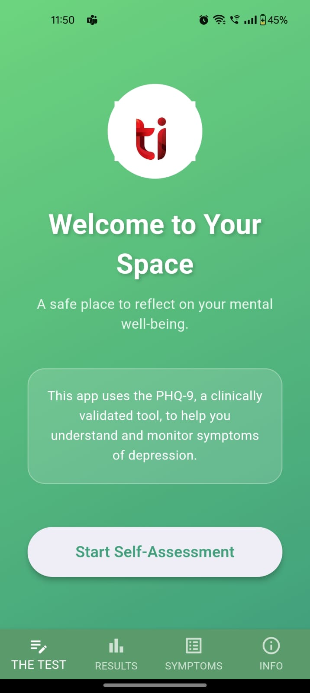
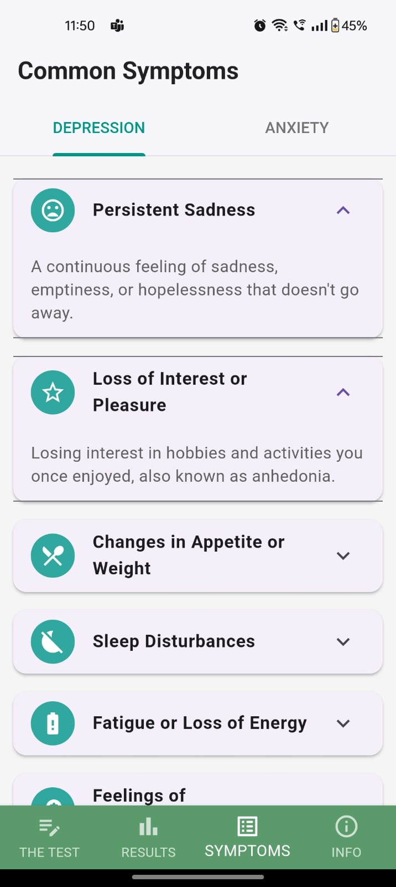
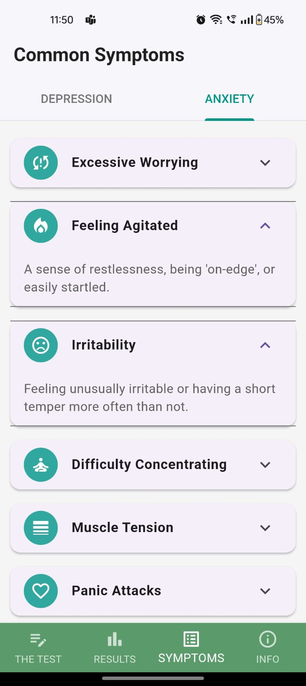
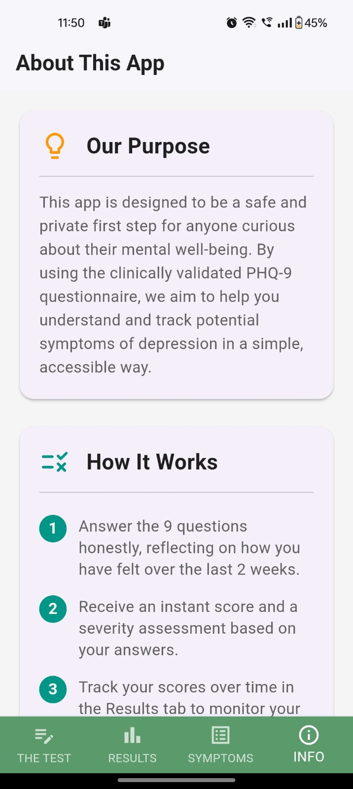
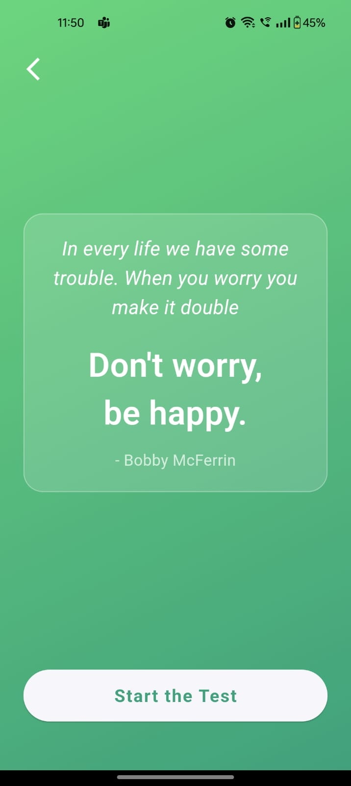
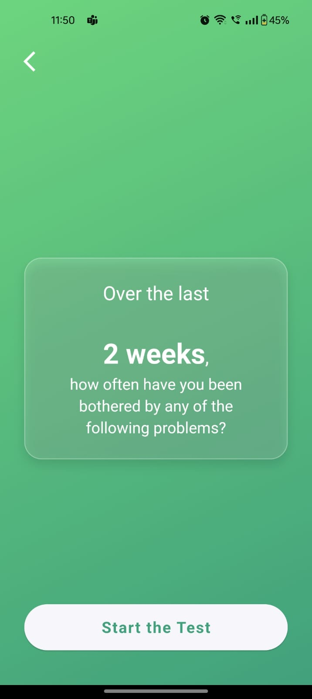
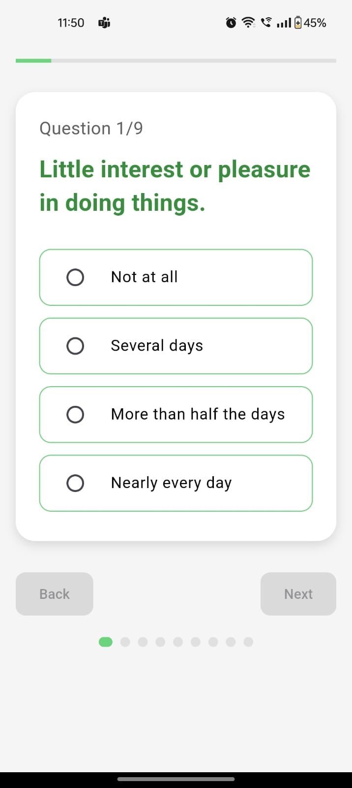
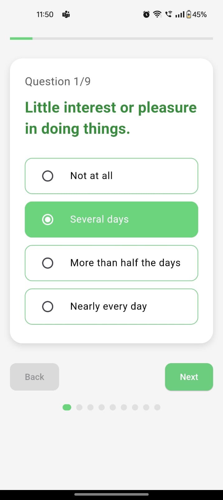

# 🧠 MindCheck – The Depresso-TEST  
*A Flutter-Based Mental Health Screening App*
## 📱 App Screenshots

### 🧪 Test Page


### 📝 Test Selection


### ✅ Submission Flow


### 📊 Result Graph


### 📈 Score Trend


### 🩺 Symptoms Library


### 🔁 Retest Prompt


### 🧾 Final Report


### 💡 Tips / Info Page


**MindCheck** is a beautifully crafted Flutter application designed to assist users in performing quick, repeated self-assessments to track signs of depression and mental well-being. The app leverages psychological MCQ-based tests, an intuitive user experience, and visually rich analytics to provide a simple yet insightful approach to mental health tracking.

---

## ✨ Features

### 📋 Multi-Test MCQ System
- Structured MCQ-based questionnaires rooted in clinically-informed models.
- Users can take 2–3 short tests at regular intervals to assess emotional and mental states.
- Each test is dynamically loaded and scored in real-time for a responsive experience.

### 📊 Dynamic Result Reporting
- Dedicated results page with dynamic, interactive graphs.
- Visualize mood trends over time and spot emerging mental health patterns.

### 🩺 Symptoms Library
- A comprehensive list of symptoms related to depression and mental health.
- Educational content to inform users and encourage self-awareness.

### 🧾 Personalized Progress Reports
- Aggregated insights from multiple tests.
- Designed to promote reflection, not diagnosis—clear, compassionate, and actionable.

### 🎨 Clean UI/UX
- Built using modern Flutter UI components.
- Fully responsive and mobile-optimized for a seamless experience across devices.

---

## 🚀 Use Cases

- **Self-Tracking:** For users monitoring their mental well-being over time.  
- **Educational Tool:** Ideal for workshops, academic settings, or awareness drives.  
- **First Step:** A non-invasive starting point before seeking professional consultation.

---

## 🧱 Tech Stack

- **Flutter** – Cross-platform UI toolkit.  
- **Dart** – High-performance programming language.  
- **State Management** – *Provider / Riverpod / GetX* (mention the one you used).  
- **Charts** – *fl_chart*, *syncfusion_flutter_charts*, or any library used.  
- **Storage** – *Local Storage / Firebase* (if applicable).  

---

## 🔐 Disclaimer

> This app is **not a diagnostic tool** and should **not replace professional medical advice**.  
It is intended to raise awareness and support personal reflection. Always consult a qualified mental health professional for clinical concerns.

---

## 📥 Installation

To clone and run this app locally:

```bash
git clone https://github.com/yourusername/mindcheck-app.git
cd mindcheck-app
flutter pub get
flutter run
